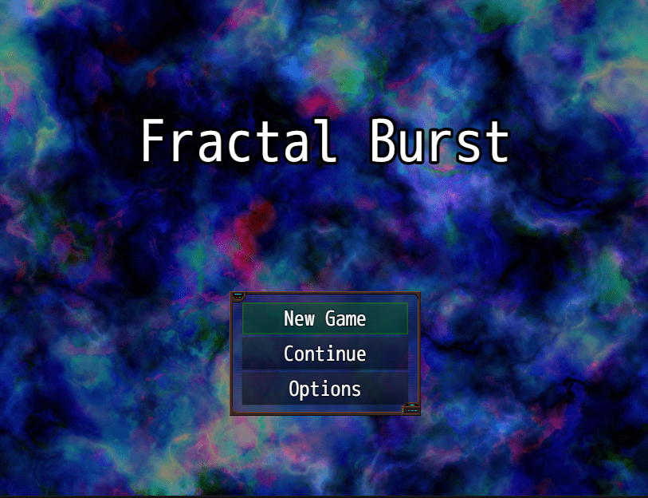

# Fractal Burst
Fractals are repeating patterns, often found throughout nature. Time is one. Follow Isaac and his android partner in attempting to alter the neverending fractal of time.

Fractal Burst was created for the 6th Anuual Driftwood Gaming Jam and is my first attempt at game development. I chose the themes
- Not what it seems
- Time Travel
- Babies (You'll understand by the end)

I had a lot of fun making this game, from writing the story and dialogue to creating the soundtrack. RPG Maker MZ is a nifty little engine and I appreciate how fast it let me get a game up and running. The plugin system is also great, and I enjoyed writing some custom JS code (The major one being the four corner battle screen [Check here for my plugin](https://github.com/Zami77/RPG_Maker_MZ_Plugins/tree/main/FourCornersBattleScreen)). Future endeavors I may branch out to game engines like Unity or the Unreal engine, but for now I'm happy with RPG Maker MZ.

The game was designed to be completed in under 30 minutes, and will most likely clock in at about 20 minutes. At the bottom of this readme is a guide to get you through the puzzles and some combat strategy, if you need it.

## Screenshots

## Credits
Game: Dan Lungaro  
Music: Dan Lungaro  
Assets: RPG Maker MZ RTP, Visustella Horror School, Horror City Hospital, Cyber Sci-Fi SFX, Crystal Cavern Asset Pack, Tyler Warren 
Game Engine: RPG Maker MZ  

## Strategy Guide
### Combat Tips
Teff is a support android, so use him like one! He can be used to heal and give items (such as soda) to Isaac. This lets Isaac use his big damage attacks, specifically the Time Bullet you gain at level 5. 

Teff's rocket launcher ability he gains at level 3 is an area effect, so it's highly effective against a group of enemies. 

If you are struggling at any point, make sure to buy additional items at the vending machines. An easy strategy to beat most enemies is to have Isaac use his special attacks while Teff gives him soda to replenish his MP.

If you want additional experience, defeat all the enemies in the top left corner room. If you defeat all of them and the nightmare creature boss, you will be at level 7, making the final boss a bit easier.

### Puzzle Answers
Seconds in a year: 31,536,000  

Computer Quiz Answer #1: "what is undone is undone"  
Computer Quiz Answer #2: "An infinitely repeating pattern"  
Computer Quiz Answer #3: "SU-T3F"  

8 is the number you seek in the top left corner room. 

